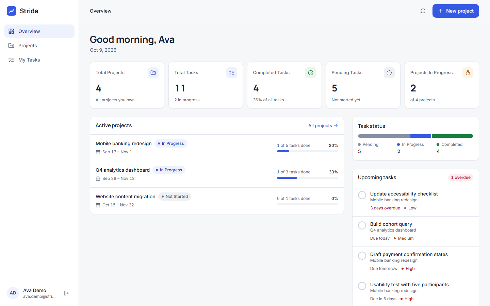
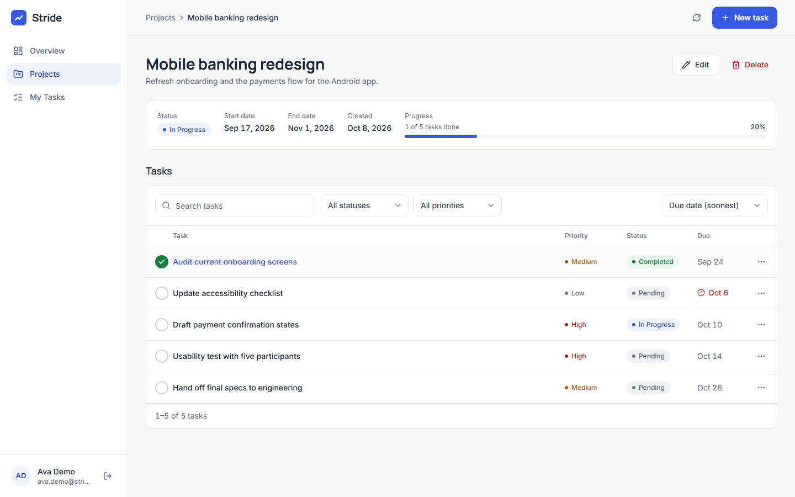
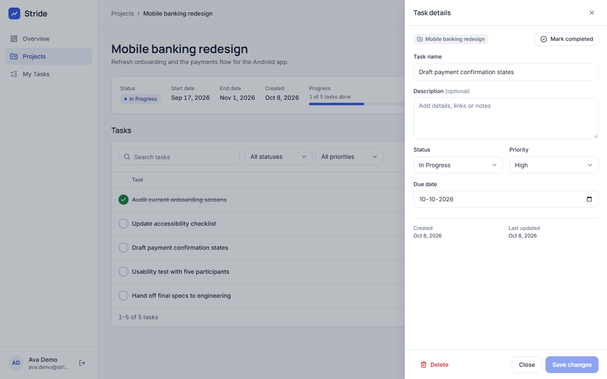
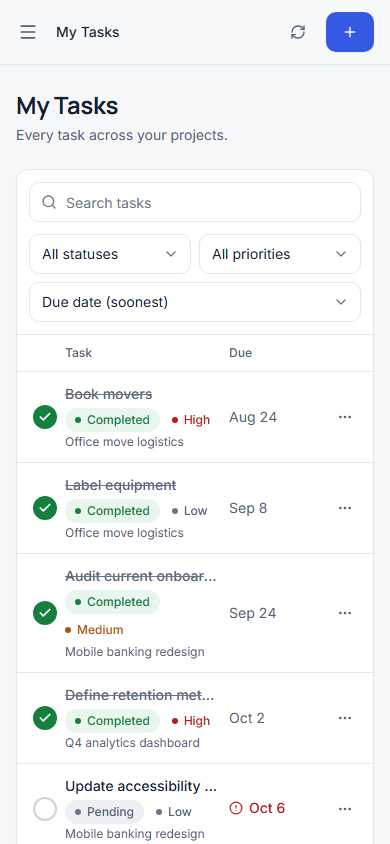

# Stride

Stride is a project and task manager with a **React web app** and a native **Android app** (Expo / React Native) that share **one Express API and one PostgreSQL database**. Sign in with the same account on either platform, create projects, break them into tasks, track progress, and see the same data on both after a refresh.



| Project details                                             | Task drawer                                                  | Phone layout                                                    |
| ----------------------------------------------------------- | ------------------------------------------------------------ | --------------------------------------------------------------- |
|  |  |  |

**Live:** https://stride-j1ec.onrender.com (web) · https://stride-j1ec.onrender.com/api (API). Free hosting: the first visit after 15 idle minutes takes ~30–60 s while the server wakes.

**Links:** [submission & live URLs](docs/submission.md) · [API reference](docs/api.md) · [architecture & ER diagram](docs/architecture.md) · [requirements checklist](docs/requirements.md) · [demo script](docs/demo-script.md)

## Features

- **Accounts:** register, log in, log out. Emails are unique (case-insensitive), passwords are bcrypt-hashed, and sessions are revocable server-side.
- **Projects:** create, view, edit, delete (with their tasks). Fields: name, description, status (Not Started / In Progress / Completed), start date, end date, created date.
- **Tasks:** create, edit, delete, mark completed or reopen. Fields: name, description, priority (Low / Medium / High), status (Pending / In Progress / Completed), due date, created date.
- **Dashboard:** Total Projects, Total Tasks, Completed Tasks, Pending Tasks, Projects In Progress, plus active projects, upcoming and overdue tasks, and a task-status breakdown — all computed per user on the server.
- **Search and filters:** projects by name and status; tasks by name, status and priority (combinable), with sorting and pagination.
- **Android:** the same account and data, a dashboard, projects and their tasks, task create/edit/delete/complete, status and priority changes, search and filters, pull-to-refresh, the token in secure storage, a clear message when the session expires, and an offline banner instead of a crash.
- **Security:** JWT + database sessions, HttpOnly cookies (web) and bearer tokens (mobile), strict ownership checks, Zod validation of every request, parameterised queries via Prisma, rate-limited auth endpoints, a CSRF origin check, Helmet headers, CORS restricted to configured origins, and redacted structured logs.

## Tech stack

| Layer    | Choice                                                                                                                             |
| -------- | ---------------------------------------------------------------------------------------------------------------------------------- |
| Web      | React 19, Vite 7, React Router 7, TanStack Query 5, React Hook Form + Zod, Tailwind CSS 4, Radix primitives, Lucide icons          |
| Android  | Expo SDK 57 (React Native 0.86), Expo Router, TanStack Query, React Hook Form + Zod, Expo SecureStore, NetInfo, native date picker |
| API      | Node.js 22, Express 5, Prisma 7 (`@prisma/adapter-pg`), jsonwebtoken, bcryptjs, Helmet, express-rate-limit, pino                   |
| Database | PostgreSQL 17                                                                                                                      |
| Shared   | `packages/shared`: Zod schemas, enums, response types, date helpers, API client                                                    |
| Tooling  | pnpm 10 workspaces, TypeScript 6, ESLint 9, Prettier, Vitest + Supertest, Playwright, Docker, GitHub Actions                       |

## Repository layout

```
apps/api         Express REST API · Prisma schema, migrations, seed · integration tests
apps/web         React web app · Playwright smoke test
apps/mobile      Expo Router Android app · EAS build profiles
packages/shared  Code shared by all three apps
docs             API reference, architecture, requirements, demo script, submission
```

## Getting started (local)

**Prerequisites:** Node.js 22 (≥ 22.12), pnpm 10 (`corepack enable`), Docker Desktop. For Android: the Expo Go app on a phone, or an Android emulator.

```bash
git clone https://github.com/aksharaagarwal21/Stride.git
cd Stride
pnpm install                         # also generates the Prisma client
cp apps/api/.env.example apps/api/.env
# then set JWT_SECRET in apps/api/.env, e.g.:
#   node -e "console.log(require('crypto').randomBytes(48).toString('base64url'))"

pnpm db:up                           # PostgreSQL 17 in Docker (creates stride + stride_test)
pnpm db:deploy                       # apply the committed migrations
pnpm db:seed                         # optional: two demo accounts with sample data
pnpm dev                             # API on :4000 and web on http://localhost:5173
```

Demo accounts created by `pnpm db:seed` (synthetic test data only):

| Email                  | Password         |
| ---------------------- | ---------------- |
| `ava.demo@stride.test` | `StrideDemo123!` |
| `leo.demo@stride.test` | `StrideDemo123!` |

The seed only replaces these two accounts and refuses to run when `NODE_ENV=production`. It is never run automatically.

### Android app (development)

```bash
pnpm dev                             # keep the API running
pnpm dev:mobile                      # starts Expo; scan the QR code with Expo Go
```

The app finds the API automatically: with `EXPO_PUBLIC_API_URL` unset, it uses the IP address of the machine running Expo, port 4000, so a phone on the same Wi-Fi works. Otherwise set `EXPO_PUBLIC_API_URL` in `apps/mobile/.env`:

| Running on                   | `EXPO_PUBLIC_API_URL`                |
| ---------------------------- | ------------------------------------ |
| Android emulator             | `http://10.0.2.2:4000`               |
| Phone on the same Wi-Fi      | `http://<your-computer-LAN-IP>:4000` |
| Against the deployed backend | `https://<deployed-host>`            |

### Running the Android app against the deployed backend

- **Install the APK:** download it from the link in [docs/submission.md](docs/submission.md) on an Android phone, allow "install unknown apps" for your browser, and open it. The APK already points at the deployed HTTPS API.
- **From source:** set `EXPO_PUBLIC_API_URL=https://<deployed-host>` in `apps/mobile/.env`, then run `pnpm dev:mobile`.
- **Build your own APK** (requires a free Expo account):

  ```bash
  cd apps/mobile
  npx eas-cli@latest login
  npx eas-cli@latest init              # links the project to your Expo account (adds projectId)
  # set EXPO_PUBLIC_API_URL for the "preview" profile in eas.json
  npx eas-cli@latest build --platform android --profile preview
  ```

  The `preview` profile produces an installable `.apk` that does not need Metro or a development computer.

## Scripts

| Command                                             | What it does                                                                    |
| --------------------------------------------------- | ------------------------------------------------------------------------------- |
| `pnpm dev`                                          | API (`tsx watch`) + web (Vite) in parallel                                      |
| `pnpm dev:api` / `pnpm dev:web` / `pnpm dev:mobile` | run one app                                                                     |
| `pnpm build`                                        | production build of the web app and the API bundle                              |
| `pnpm start`                                        | run the built API (serves the web build when `SERVE_WEB=true` or in production) |
| `pnpm lint` / `pnpm format` / `pnpm format:check`   | ESLint / Prettier                                                               |
| `pnpm typecheck`                                    | TypeScript in every workspace                                                   |
| `pnpm test`                                         | shared unit tests + API integration tests (uses `TEST_DATABASE_URL`)            |
| `pnpm test:e2e`                                     | Playwright browser smoke test (starts `pnpm dev` if needed)                     |
| `pnpm db:up` / `pnpm db:down`                       | start / stop the Docker PostgreSQL                                              |
| `pnpm db:migrate`                                   | create and apply a migration in development (`prisma migrate dev`)              |
| `pnpm db:deploy`                                    | apply committed migrations (`prisma migrate deploy`) — the production command   |
| `pnpm db:seed`                                      | load the demo accounts (development only)                                       |

## Testing

```bash
pnpm db:up
pnpm test          # 8 shared unit tests + 37 API integration tests
pnpm test:e2e      # browser: register → project/task CRUD → filters/dashboard → logout
```

Integration tests run against `stride_test` (created by the Docker init script). They refuse to run unless the database name ends in `_test`, because they truncate every table. They cover normalised unique emails, hash storage, missing/invalid/expired/revoked tokens, cross-user isolation on every endpoint, forged and unknown fields, invalid enums and dates, combined filters, pagination metadata, dashboard aggregates across many records, cascade deletes, rate limiting, CSRF and cookie/bearer parity.

## Environment variables

### API (`apps/api/.env`, see `.env.example`)

| Variable                                                 | Required | Default                              | Purpose                                                                                                             |
| -------------------------------------------------------- | -------- | ------------------------------------ | ------------------------------------------------------------------------------------------------------------------- |
| `DATABASE_URL`                                           | yes      | —                                    | PostgreSQL connection string                                                                                        |
| `JWT_SECRET`                                             | yes      | —                                    | HMAC secret for session JWTs, ≥ 32 characters. Server-only.                                                         |
| `JWT_ISSUER` / `JWT_AUDIENCE`                            | no       | `stride-api` / `stride-clients`      | checked on every token                                                                                              |
| `SESSION_TTL_HOURS`                                      | no       | `12`                                 | lifetime of the JWT, the database session and the cookie                                                            |
| `PORT`                                                   | no       | `4000` (`8080` in Docker)            | HTTP port; the server binds to `0.0.0.0`                                                                            |
| `NODE_ENV`                                               | no       | `development`                        | `production` enables secure cookies and web serving                                                                 |
| `CORS_ORIGINS`                                           | no       | —                                    | comma-separated browser origins allowed for CORS and the CSRF check. The server's own origin is always allowed.     |
| `TRUST_PROXY`                                            | no       | `0`                                  | number of reverse proxies in front of the app (use `1` on Railway/Render), so rate limiting sees the real client IP |
| `COOKIE_SECURE`                                          | no       | `true` in production                 | set `false` only for plain-HTTP local runs                                                                          |
| `SERVE_WEB` / `WEB_DIST_DIR`                             | no       | production: `true` / `apps/web/dist` | serve the built web app from the API                                                                                |
| `BCRYPT_ROUNDS`                                          | no       | `12`                                 | bcrypt cost (10–15)                                                                                                 |
| `AUTH_RATE_LIMIT_MAX` / `AUTH_RATE_LIMIT_WINDOW_MINUTES` | no       | `10` / `15`                          | login/register attempts per IP per window                                                                           |
| `LOG_LEVEL`                                              | no       | `info`                               | pino log level                                                                                                      |
| `TEST_DATABASE_URL`                                      | tests    | `…/stride_test`                      | disposable database for `pnpm test`                                                                                 |

### Web (`apps/web/.env`, optional)

| Variable           | Purpose                                                                                                                         |
| ------------------ | ------------------------------------------------------------------------------------------------------------------------------- |
| `VITE_API_URL`     | only if the web app is hosted separately from the API; leave empty for same-origin `/api`. **Public** — embedded in the bundle. |
| `API_PROXY_TARGET` | development proxy target for `/api` (default `http://localhost:4000`); not shipped to the browser                               |

### Mobile (`apps/mobile/.env` or `eas.json` → `env`)

| Variable              | Purpose                                                            |
| --------------------- | ------------------------------------------------------------------ |
| `EXPO_PUBLIC_API_URL` | API origin (no `/api` suffix). **Public** — compiled into the app. |

`VITE_*` and `EXPO_PUBLIC_*` values are visible to anyone with the app, so they must never contain secrets.

## Deployment

The production image (`Dockerfile`) builds the web app and the API, then runs **one container** that serves `/api` and the web app from the same origin. On start it runs `prisma migrate deploy` (committed migrations only — never a reset or `db push`) and then the server. A health check calls `/api/health/ready`.

```bash
docker compose --profile app up --build     # PostgreSQL + the production image on http://localhost:8080
```

### Live deployment (Render + Neon)

The live app runs on Render's free Docker web service, configured by [`render.yaml`](render.yaml), with PostgreSQL on Neon. Both are in Singapore.

1. Create a Neon project and copy its **direct** connection string (connection pooling off; Prisma Migrate needs a direct connection).
2. In Render, choose **New → Blueprint**, select this repository and branch, and paste the string as `DATABASE_URL`. `JWT_SECRET` is generated by Render; `NODE_ENV=production` and `TRUST_PROXY=1` come from the blueprint.
3. Every push to the branch rebuilds the image; on start the container runs `prisma migrate deploy` and then serves the app.

If the database URL points at a connection pooler, set `DIRECT_DATABASE_URL` to the direct URL for migrations and `RUN_MIGRATIONS=false` to run them as a separate release step (`pnpm db:deploy`).

### Any other container host

To deploy on another container host with PostgreSQL (e.g. Railway, Fly.io, Cloud Run):

1. Create a PostgreSQL database and copy its connection string.
2. Deploy this repository with the `Dockerfile`.
3. Set `DATABASE_URL`, `JWT_SECRET` (new random value), `NODE_ENV=production`, `TRUST_PROXY=1` and `CORS_ORIGINS=https://<your-app-host>`. The platform provides `PORT`.
4. Open `https://<your-app-host>` (web) — the API is `https://<your-app-host>/api`.

Do not run `pnpm db:seed` against a public deployment.

## Continuous integration

`.github/workflows/ci.yml` runs on every push and pull request: install, lint, format check, typecheck (all four workspaces), unit + integration tests against a PostgreSQL service, the production build, and the Playwright smoke test.
