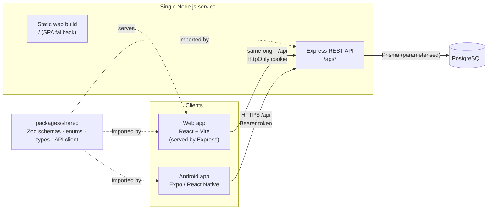
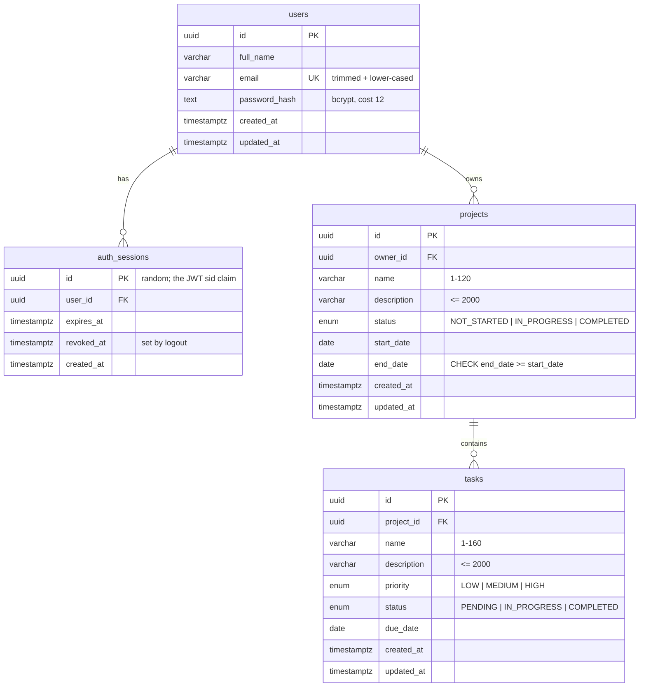
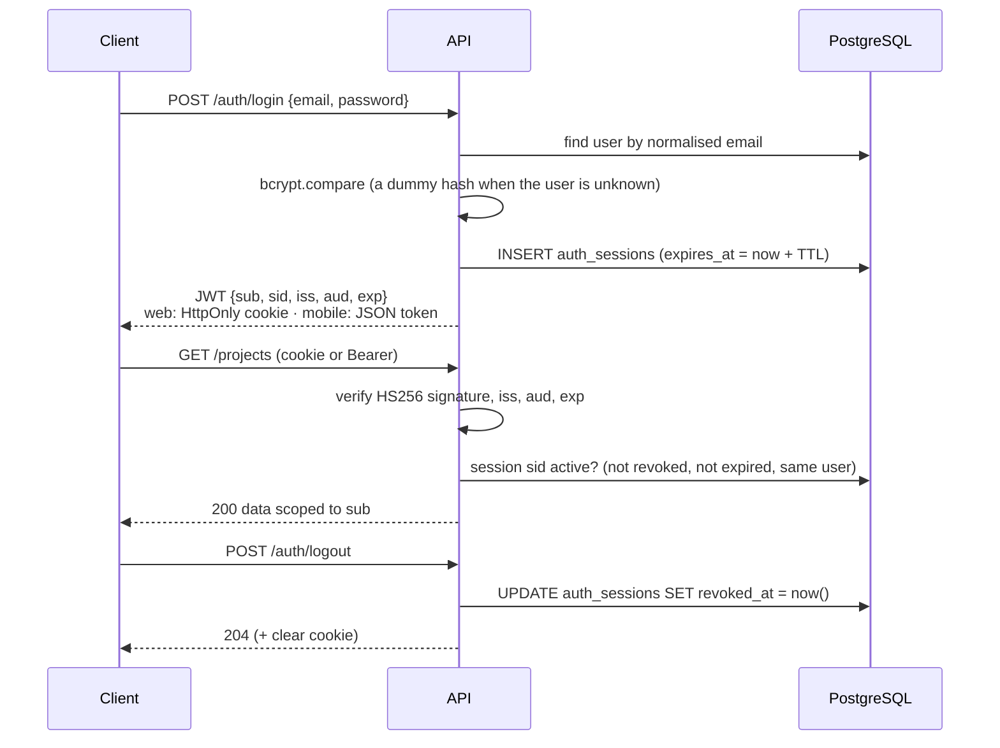

# Stride architecture

## One backend, two clients



- **One Express service** exposes the REST API under `/api` and, in production, also serves the built web app. The browser therefore calls `/api` on its own origin, so the session cookie is never cross-site.
- **One PostgreSQL database.** There is no separate mobile backend: the Android app calls the same endpoints over HTTPS.
- **`packages/shared`** holds what both sides must agree on: the Zod request schemas (used by the API for validation and by both apps' forms), the enums and their labels, the response types, the date-only helpers and a small `fetch`-based API client. Each app injects its own authentication behaviour into the client. The package has no React, DOM, Node-only or native-storage dependencies.

### Repository layout

```
apps/api         Express API, Prisma schema + migrations, integration tests
apps/web         React web app (Vite, React Router, TanStack Query, Tailwind)
apps/mobile      Expo Router Android app (TanStack Query, SecureStore, NetInfo)
packages/shared  Schemas, enums, types, dates, API client
docs             Requirements, API reference, this file, demo script, submission
```

API code is organised by feature (`modules/auth`, `modules/projects`, `modules/tasks`, `modules/dashboard`). Each feature has a routes file (HTTP + validation) and a service file (ownership-scoped Prisma queries). Cross-cutting concerns live in `middleware/` (auth, CSRF, rate limits, request logging, errors).

## Data model



- **Normalised ownership.** Tasks have no owner column; a task belongs to whoever owns its project. There is no second copy that could drift.
- **Foreign keys cascade:** deleting a user removes their sessions and projects; deleting a project removes its tasks.
- **Indexes:** `projects(owner_id, status)`, `projects(owner_id, created_at)`, `tasks(project_id, status, priority)`, `tasks(due_date)`, `auth_sessions(user_id)`, unique `users(email)`.
- **Database-level checks** (in the first migration): end date ≥ start date, non-blank names, normalised email. The API validates the same rules first and returns friendly field errors.
- **Dates:** start, end and due dates are PostgreSQL `date` columns and travel as `"YYYY-MM-DD"`. Shared helpers never parse them with `new Date("YYYY-MM-DD")` (which would shift the day west of UTC). Name columns use the ICU collation `und-x-icu`, so "alpha" sorts next to "Alpha".

## Ownership model

Every query is scoped by the authenticated user id taken from the verified session, never from the request:

- Projects: `WHERE id = :id AND owner_id = :userId`.
- Tasks: `WHERE id = :id AND project.owner_id = :userId` (a relation filter).
- Creating a task first loads the target project with the owner filter; if it is someone else's, the response is `404`.
- Filtering tasks by `projectId` checks project ownership first, so probing another user's project id returns `404`, not an empty list.
- Request schemas are strict, so `ownerId`, `userId` or a changed `projectId` in a body is a `400`.
- "Not found" and "not yours" are the same `404`, so the API never confirms that another user's record exists.

All database access goes through Prisma's query builder (parameterised). The only raw SQL is the static `SELECT 1` readiness probe and the test-suite truncate.

## Authentication and sessions



- **Passwords:** bcrypt (cost 12). Passwords over 72 UTF-8 bytes are rejected because bcrypt would silently ignore the rest. Wrong-password and unknown-email failures return the same message and take similar time.
- **JWT + session row:** the JWT has minimal claims (`sub` user id, `sid` session id, `iss`, `aud`, `exp`). Verification pins the algorithm to HS256 and checks issuer, audience and expiry, then requires the `auth_sessions` row to exist, belong to `sub`, be unrevoked and unexpired. That database check is what makes **logout effective immediately**: a copied token stops working as soon as its session is revoked.
- **One TTL** (`SESSION_TTL_HOURS`, default 12) drives the JWT `exp`, the session's `expires_at` and the cookie's `Expires`.
- **Several sessions per user:** each login creates its own session, so signing out on the web does not sign the phone out.
- **Web transport:** HttpOnly, `SameSite=Lax`, `Path=/api` cookie, `Secure` in production. JavaScript never sees the token. On load the app calls `/auth/me` and shows a splash screen until it answers, so protected screens never flash. CSRF protection is an Origin check on every write (see the API reference).
- **Mobile transport:** the same endpoints with `X-Client-Platform: mobile` return the JWT in the body. The app stores it with **Expo SecureStore** (encrypted with a key in the Android Keystore), sends it as `Authorization: Bearer`, and keeps an in-memory copy to avoid a keystore read per request. It is never written to AsyncStorage, logs or URLs.

### Expired sessions and offline behaviour

| Situation                             | Web                                                                                                                         | Android                                                                                          |
| ------------------------------------- | --------------------------------------------------------------------------------------------------------------------------- | ------------------------------------------------------------------------------------------------ |
| Any authenticated request returns 401 | cache cleared, redirect to login: "Your session expired. Please sign in again." (returns to the same page after signing in) | token deleted from SecureStore, cache cleared, login screen with the same message                |
| Network failure                       | error state with Retry; the user stays signed in                                                                            | offline banner, cached data labelled as cached, Retry; **token kept**                            |
| Launch while offline                  | —                                                                                                                           | opens with the saved profile; the next successful request re-validates the token                 |
| Logout while offline                  | error toast; still signed in (the HttpOnly cookie can only be cleared by the server)                                        | token removed locally, with a message that the server could not be reached to revoke the session |

Reads retry twice on network errors only; writes are never retried automatically, so a create cannot be duplicated. Edits made offline are not queued — the UI says so instead of pretending they synced.

## Cross-platform refresh

Both apps use TanStack Query with shared query keys. Any successful write invalidates project lists and details, task lists and details, and the dashboard, so the screen re-reads from the server. Data written on one platform appears on the other when:

- **Web:** the window regains focus, a page is opened, or the header Refresh button is pressed.
- **Android:** the user pulls to refresh (the list or dashboard re-fetches every loaded page from the API), the app returns to the foreground, or connectivity returns.

There are no WebSockets: a refresh is the agreed sync point, which keeps the system simple and matches the assignment.

## Logging and errors

- `pino` + `pino-http`: one JSON line per request with a request id (echoed as `X-Request-Id`), method, URL, status and duration. Only those fields are logged; headers and bodies are not. Authorization headers, cookies, passwords, tokens and secrets are also redacted at the logger level.
- A single error middleware turns validation errors, bad JSON, payload limits and known Prisma errors into the shared error body; anything unexpected is logged in full and returned as a generic `500`.
- Unknown `/api/*` routes return a JSON `404` and never fall through to the web app's HTML.

## Trade-offs

- **Sessions in PostgreSQL instead of pure stateless JWTs** — one indexed lookup per request in exchange for real logout and revocation. No refresh tokens: a 12-hour session is enough for this scope, and the user signs in again afterwards.
- **In-memory rate limiting** — correct for one instance. Several instances would need a shared store (e.g. PostgreSQL or Redis), deliberately left out to keep the stack small.
- **Pessimistic UI updates** — the UI changes after the server confirms. A little slower than optimistic updates, but success messages are always true.
- **Same-origin web deployment** — Express serves the web build, avoiding cross-site cookie and CORS complexity. `VITE_API_URL` still allows a separately hosted web app.
- **Project status is manual** — completing every task does not auto-complete the project; the user decides.
- **No offline writes on mobile** — avoids conflict resolution. Offline, the app shows cached data and clearly refuses to pretend edits were saved.
- **System font on Android** — Roboto instead of bundling Manrope/Inter keeps the native build simple; hierarchy comes from weight and size.
